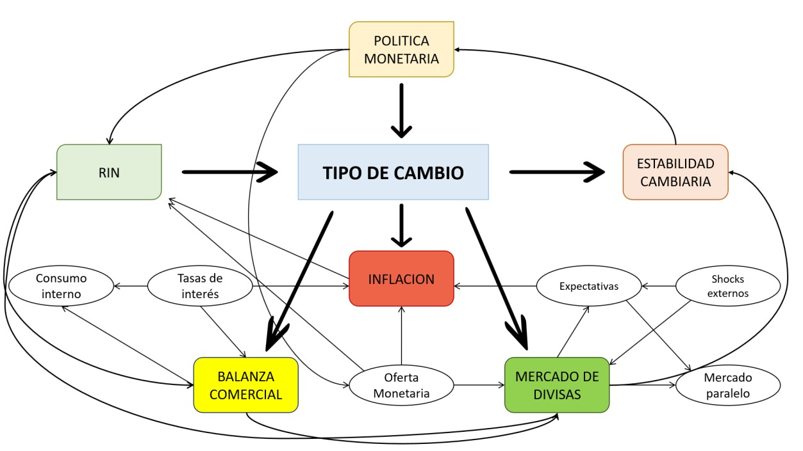

# =========================================
# ANÁLISIS MICMAC - ECONOMÍA BOLIVIANA
# =========================================

***Maestría en Ingeniería Matemática***

MOD9-MODELOS MATEMATICOS EN MICROECONOMIA AVANZADA

**Grupo:**
- Gimena Javier Vargas
- Christian Giovanni Ortiz
- Ivan Mamani Condori

---

